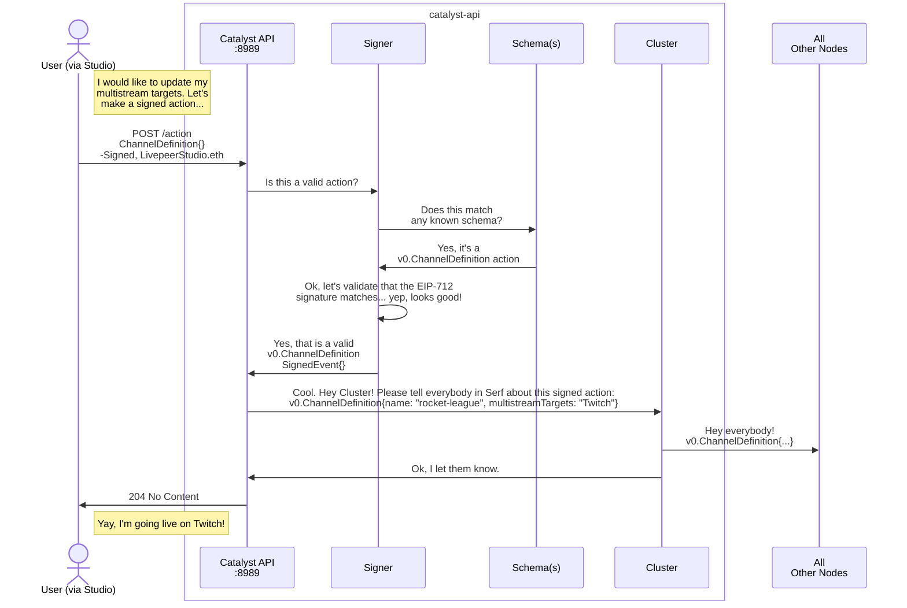
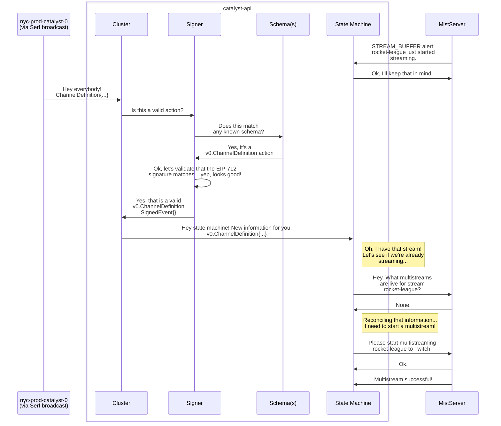

# Live Multistreaming Workflow

## nyc-prod-catalyst-0.example.com



## lon-prod-catalyst-0.example.com



Signing is made up a few components and will eventually support many different
signing schemes. For the moment, we're using EIP-712 signing, making use of
Ethereum's secp256k1 signatures, but all of the following concepts could be
adapted to use Farcaster, JWTs, UCANs, etc.

## Core concepts

### Action

The core interface of the signing flow is the Action. Actions are considered to
be a statement of user intent, and users and integrating applications sign them
to interact with the system. Here's a simple `v0.ChannelDefinition` action:

```json
{
  "id": "my-awesome-stream",
  "multistreamTargets": [
    {
      "url": "rtmp://localhost/foo/bar"
    }
  ],
  "signer": "0x1964035e4C3cD05b8Ff839EFBf37063D8d1Ba7ae",
  "time": 1681403259137
}
```

All actions have two required fields:

- `signer`: This is the address that signed the action in question. While this
  can technically be recovered from the signature, including it in the payload
  body is useful to validate that a particular payload is only valid when signed
  by a particular wallet.

- `time`: This is a millisecond-precision Unix timestamp of when the action was
  signed. While there is no guarantee that this time will be accurate in a
  decentralized environment, its presence is still useful for establishing a
  user intent; in this example, newer v0.ChannelDefinitions override older ones.

### Signed Events

Once an action is signed, it becomes the payload of a SignedEvent object. This
particular SignedEvent looks like this:

```json
{
  "primaryType": "ChannelDefinition",
  "domain": {
    "name": "Livepeer Decentralized Video Protocol",
    "version": "0.0.1"
  },
  "message": {
    "id": "my-awesome-stream",
    "multistreamTargets": [
      {
        "url": "rtmp://localhost/foo/bar"
      }
    ],
    "signer": "0x1964035e4C3cD05b8Ff839EFBf37063D8d1Ba7ae",
    "time": 1681403259137
  },
  "signature": "0x34ed2b69881f79f153c0a4e6e3313e58b642be227cd91cc2ef1e7e8d04d3c89a272a3cea8da87b0b3b52c91b484d6f6d36ed9921bda89755ff60d1918d6268861c"
}
```

SignedEvents contain the following fields:

- `primaryType`: The type of this particular action.
- `domain`: The EIP-712 domain for this action. This exists primarily to prevent
  replay attacks, where the same signed payload would be involuntarily used in
  multiple unrelated contexts, but it's also useful for API versioning; we will
  use the hash of the domain later on to identify which schema should be used.
- `message`: The Action payload from above.
- `signature`: The secp256k1 signature of the domain. See
  [EIP-712](https://eips.ethereum.org/EIPS/eip-712) for full documentation, but
  it's essentially a signature of the combined hashes of the domain and message.

Once a message is signed and serialized as such, it's suitable for transmission
over the internet and archival.

### Schemas

Working with signed, immutable actions requires us to support old versions of
schemas; signed message cannot ever be migrated to new schema without
invalidating the signature. As such, we've introduced versioning of our schemas
immediately. The first version is v0, and includes a single `ChannelDefinition`
action. As we create new schema versions, we can increment the "version" number
of the schema and create new Go packages supporting all previous versions.

### Signer

The core piece of the puzzle is the signer. It's provided with an Ethereum
wallet and is capable of producing its own signed messages — though at the
moment it's only verifying messages signed by Studio and passed into its
endpoints.

In addition to a wallet, the Signer is initalized with a slice of `[]Schema` and
a single `PrimarySchema`. Any events signed by this Signer will make use of the
`PrimarySchema`, but it is capable of verifying and decoding events present in
any of the schemas its provided, allowing the same class to support all previous
versions.

### API

The signing flow makes use of a new public Catalyst endpoint at `POST /action`.
This endpoint accepts signed events in the payload, which it proceeds to
validate and pass to the cluster module to be broadcasted with Serf.

Once nodes recieve actions broadcasted by the Serf cluster, they validate the
actions again and pass them to their local state machines.

### State Machine

The `state` directory contains the `machine` class for managing a node's local
state. It is relatively simple for now, only maintaining a map of multistream
targets for streams. Eventually we'd like this to get more sophisticated.
