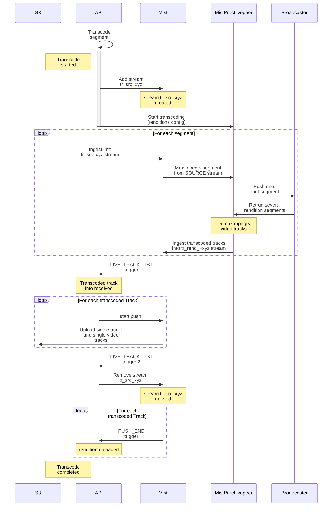

# Transcoding endpoint workflow

# Future optimizations

- Start `source` stream from `MistProcLivepeer` instead duplicating `source` stream into `/dev/null`.
- Do not send audio track to Broadcaster if no audio processing takes place. This saves on network bandwidth moving audio to B-node and back.
- Instead several consecutive steps we can have single exposed API call to Mist server. Moving entire logic into Mist server.
- Calculate correctly completion percentage sent to Studio

# MistProcLivepeer

`MistProcLivepeer` is Mist server binary used for transcoding a stream using Livepeer network.

API go code starts it directly on the same machine Mist server is running. Usually `MistController` starts other `Mist*` binaries. The Mist server architecture allows this kind of integration.

Input is a `source` stream name and output is `sink` stream name.

`source` tracks example:
- AVC video track 1920x1080p
- AAC audio track 2c 4800Hz

`sink` tracks example:
- AVC video track 1280x720
- AVC video track 640x360
- AVC video track 160x180
- AAC audio track 2c 4800Hz

`source` stream is allowed to have multiple audio and video tracks, only best audio and best video track would be sent to Livepeer Broadcaster.

# LIVE_TRACK_LIST trigger

Mist server calls back to API server:
1) When first transcoded segment is ingested. We get info for each track:
  - Type: video/audio/text
  - Vido width
  - Video height
  - FPS
  - Codec
  - Starting timestamp
  - Latest timestamp
2) When last transcoded segment is processed. We get empty list of tracks.

This trigger lets us know we have first transcoded frames ready in `sink` stream. Then we start extracting separate mpegts files to store on S3 storage.

In our example above we have 3 transcoded video tracks in same `sink` stream on Mist server. We want to produce 3 separate mpegts segments containing each video track and same audio track.

Push mechanism from Mist server is used to produce those transcoded segments.

# PUSH_END trigger

This trigger is run whenever an outgoing push stops, either upload is complete or upload failed.

We get following info:
- Stream name
- Destination given in API call
- Actual destination used after expanding server variables. We don't use this feature.
- Push status - ok/failed

This is final stage of transcoding process.

One input segment is transcoded into multiple rendition segments. We wait for all uploads to complete to invoke Studio callback of entire operation.
1) Pull from S3 HTTP into SOURCE stream
2) Transcode from SOURCE to RENDITION
3) Push from RENDITION stream to S3 rendition 1
4) Push from RENDITION stream to S3 rendition 2
5) Push from RENDITION stream to S3 rendition 3
6) Invoke callback to Studio

